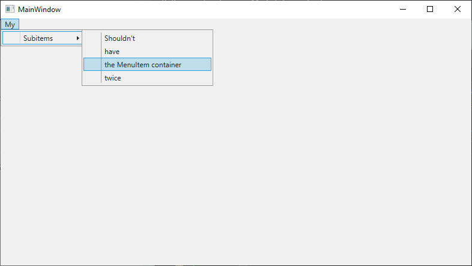
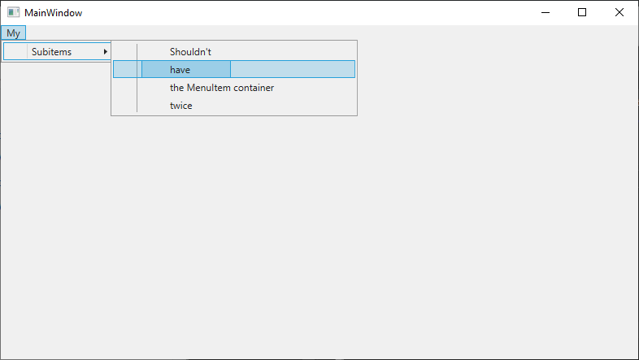

# How to reproduce

Run `rebuild` in VS2019 16.5 and debug:
The sub-menu shows up as expected:

Change SDK in `global.json` to `3.1.100`, run `rebuild` again 
in VS2019 116.5 and debug:

The sub-menu now shows up wrapped into an extra menu-item:

